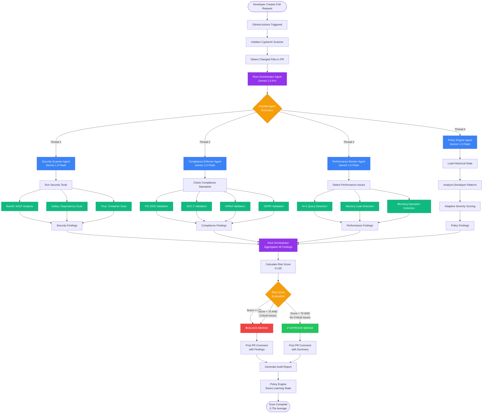
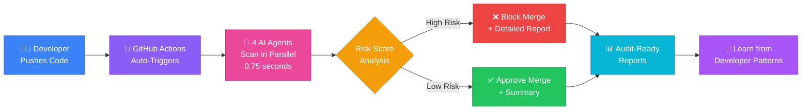
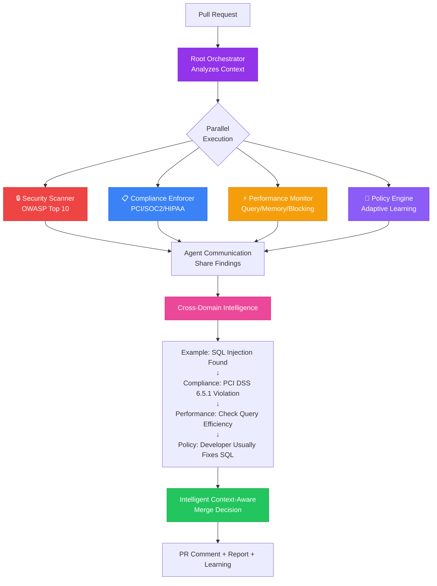
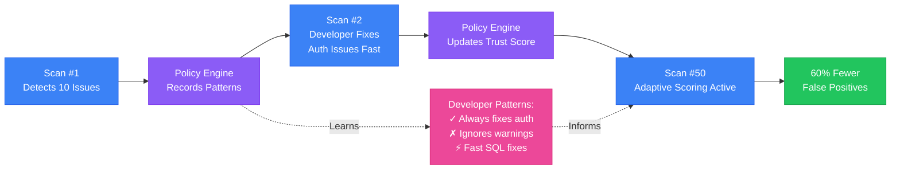

# CypherAI Workflow Diagram

## Complete System Flowchart

## Simplified User Journey

## Multi-Agent Collaboration Detail

## Adaptive Learning Flow

---

## How to Use These Diagrams

### For Kaggle Submission
1. **Take screenshots** of the rendered Mermaid diagrams above
2. **Use as thumbnail**: The "Multi-Agent Collaboration Detail" diagram works great
3. **Include in presentation**: Shows technical sophistication visually

### To Render in GitHub
- Copy this file to your GitHub repo
- GitHub automatically renders Mermaid diagrams in markdown files
- View at: https://github.com/stealthwhizz/CypherAI/blob/main/WORKFLOW_DIAGRAM.md

### To Generate PNG Images
Use one of these tools:
1. **Mermaid Live Editor**: https://mermaid.live/
   - Paste code → Copy PNG/SVG
2. **GitHub**: Push this file, GitHub renders it, take screenshot
3. **VS Code Extension**: Install "Markdown Preview Mermaid Support"
4. **Online Tools**: https://mermaid.ink/ (direct PNG export)

---

## Diagram Explanations

### Complete System Flowchart
Shows end-to-end flow from PR creation → GitHub Actions → parallel agent execution → risk calculation → merge decision. Includes all 4 agents and their specific tools.

### Simplified User Journey
High-level view for non-technical audiences. Shows developer experience in 8 simple steps.

### Multi-Agent Collaboration Detail
Highlights the key innovation: how agents share findings and create cross-domain intelligence that single-AI systems cannot achieve.

### Adaptive Learning Flow
Demonstrates how Policy Engine learns over time, reducing false positives from Scan 1 → Scan 50.

---

**Best for Kaggle Thumbnail**: Multi-Agent Collaboration Detail (shows innovation clearly)

**Best for Technical Presentation**: Complete System Flowchart (shows full architecture)

**Best for Business Audience**: Simplified User Journey (easy to understand value)
